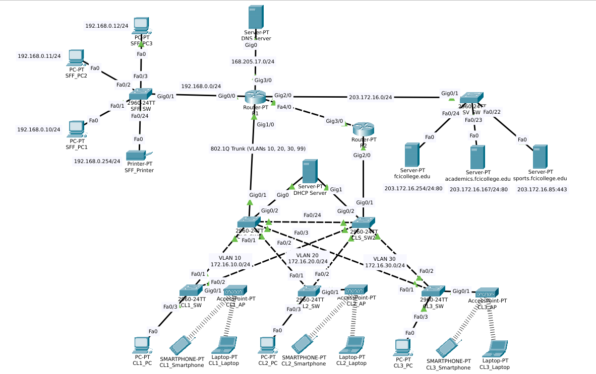

# Highly Available Campus Network Simulation

## 📌 Project Overview
This project simulates a highly resilient, multi-tier campus network architecture using Cisco Packet Tracer. The objective was to design a scalable enterprise network featuring strict logical segmentation, centralized network services, and robust High Availability (HA) at both Layer 2 and Layer 3 to eliminate single points of failure.

## ⚙️ Architecture & Technologies Implemented
The network is built around a redundant routing and distribution core, effectively segmenting Staff Operations, a Server Farm, and Student Access zones.

* **First Hop Redundancy (HSRP):** Deployed dual routers (Primary/Standby) sharing virtual IP gateways to ensure uninterrupted inter-VLAN routing during hardware failures.
* **Spanning Tree (Rapid PVST+):** Configured primary and secondary root bridges across redundant distribution switches to prevent Layer 2 broadcast loops while maintaining active backup paths.
* **Extended Access Control Lists (ACLs):** Implemented strict network security policies at the routing layer, actively denying student VLANs access to the Staff administration network.
* **VLANs & 802.1Q Trunking:** Isolated broadcast domains for distinct classrooms and management infrastructure to improve performance and security.
* **Router-on-a-Stick (Inter-VLAN):** Configured 802.1Q encapsulated sub-interfaces on central routers to facilitate controlled inter-zone communication.
* **Core Network Services (DHCP, DNS, HTTP):** Centralized DHCP utilizing IP Helper addressing across broadcast boundaries, alongside internal domain resolution (`fcicollege.edu`).

## 📊 IP Addressing & HSRP Scheme
| Network Zone | VLAN | Subnet | Virtual Gateway (VIP) | Physical Router IPs |
| :--- | :---: | :--- | :--- | :--- |
| Staff Admin | - | `192.168.0.0/24` | `192.168.0.1` | - |
| Data Center | - | `203.172.16.0/24`| `203.172.16.1` | - |
| Classroom 1 | 10 | `172.16.10.0/24` | `172.16.10.1` | R1: `.2`, R2: `.3` |
| Classroom 2 | 20 | `172.16.20.0/24` | `172.16.20.1` | R1: `.2`, R2: `.3` |
| Classroom 3 | 30 | `172.16.30.0/24` | `172.16.30.1` | R1: `.2`, R2: `.3` |
| Management | 99 | `172.16.99.0/24` | `172.16.99.1` | R1: `.2`, R2: `.3` |

## 🚀 Simulation Testing Guide
1. **Test HSRP Failover:** Open a Student PC command prompt and run a continuous ping to the server farm (`ping -t 203.172.16.254`). Deliberately sever the link between R1 and CLS_SW1; observe the traffic seamlessly reroute through R2.
2. **Verify ACL Security:** Attempt to ping a Staff PC (`192.168.0.10`) from any Classroom PC. The ICMP request will drop, confirming the security boundary is active.
3. **Test DHCP & DNS:** Toggle the IP configuration to Static and back to DHCP on a Classroom 1 laptop to pull a `172.16.10.x` address, then browse to `academics.fcicollege.edu`.
